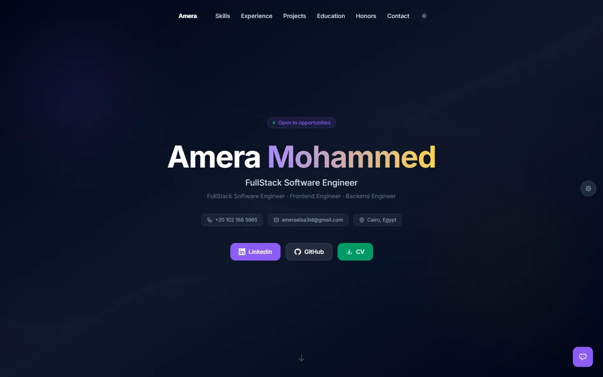
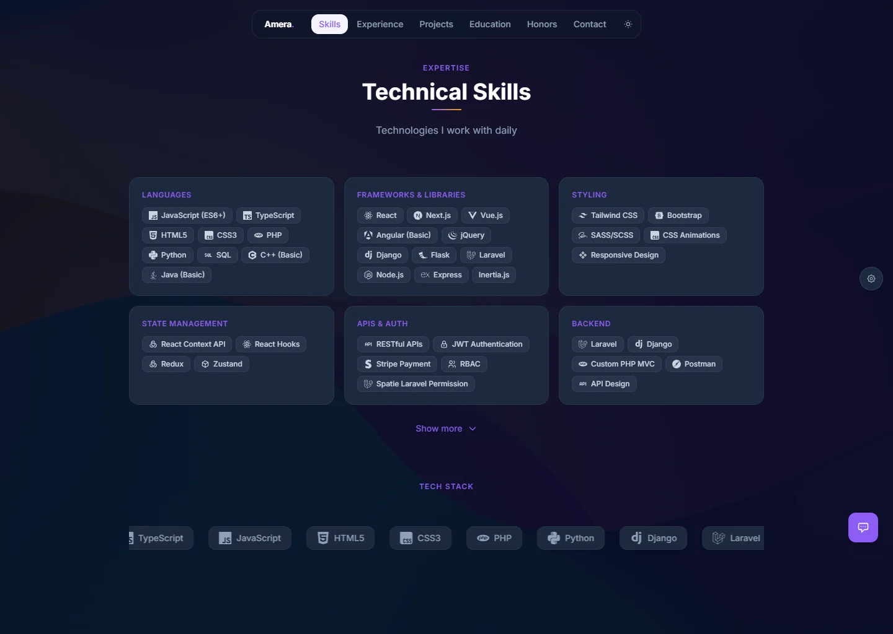
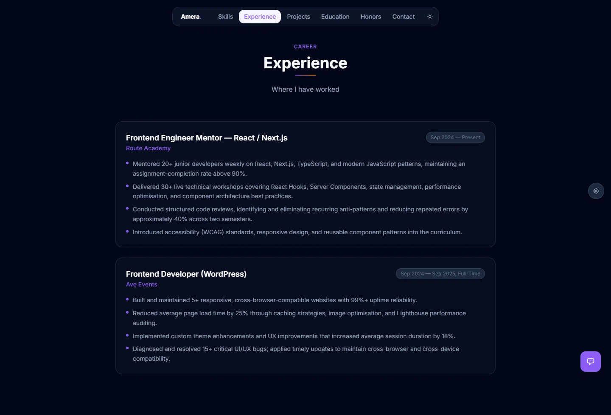
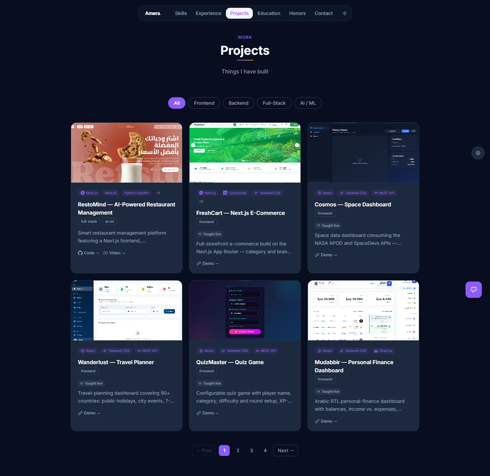
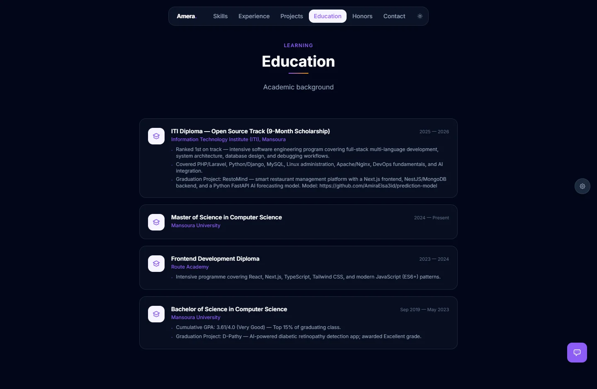
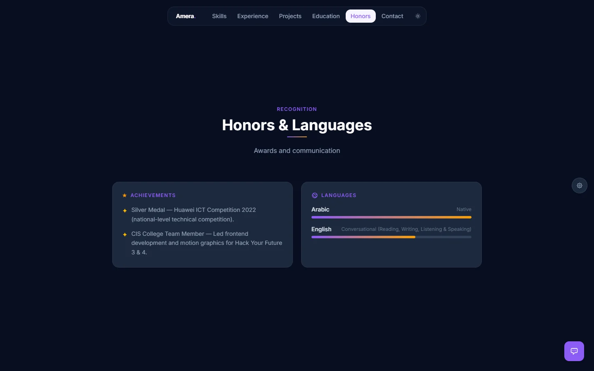
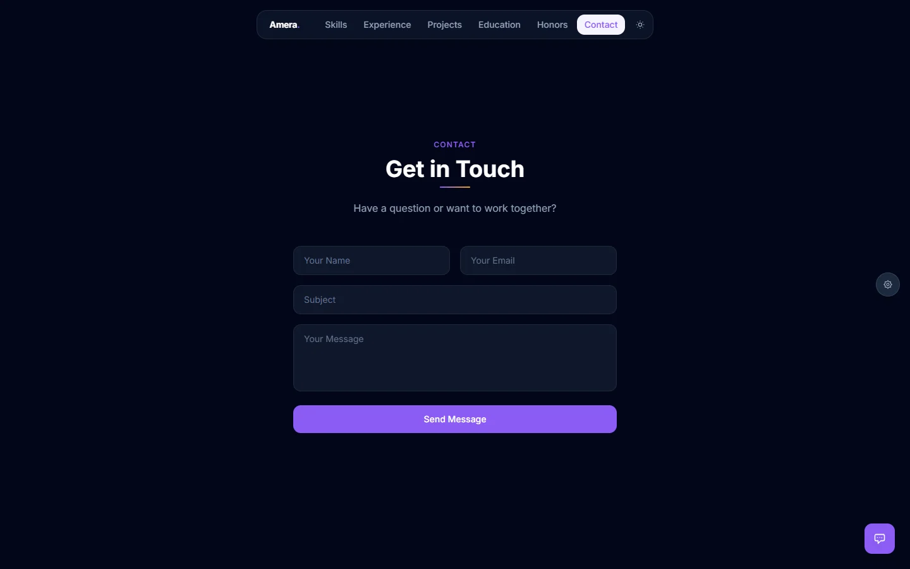

<div align="center">

# Portfolio

Personal portfolio and resume site for **Amera Mohammed** — FullStack Software Engineer.

Built with React 19, Vite and Tailwind CSS. Fully data-driven: every section reads
from a single JSON file, so content updates never require touching a component.

[](https://portfolio-amera-mohammed.vercel.app)


</div>

---

## Preview

<div align="center">
  
</div>

---

## Table of Contents

- [Preview](#preview)
- [Features](#features)
- [Sections](#sections)
- [Tech Stack](#tech-stack)
- [Getting Started](#getting-started)
- [Available Scripts](#available-scripts)
- [Project Structure](#project-structure)
- [Customising the Content](#customising-the-content)
- [Deployment](#deployment)

---

## Features

| | |
|---|---|
| **Data-driven** | All content lives in `src/data/portfolio.json` — edit the JSON, not the components |
| **Route-level code splitting** | Every section below the hero is `React.lazy` loaded behind a `Suspense` skeleton |
| **Filterable project grid** | Filter by `frontend` / `backend` / `full-stack` / `ai-ml` with pagination that respects the active filter |
| **Project modal** | Click any card for a detail view, tech badges and per-part repository links |
| **Themable accent colour** | Purple by default; switch the whole palette from one CSS variable |
| **Light & dark mode** | Full dark-mode coverage, plus scroll-spy navigation |
| **Scroll reveals** | A reusable `useInView` hook drives fade-up / stagger animations |
| **WebGL hero effect** | Fluid cursor effect that degrades gracefully when WebGL is unavailable |
| **Local Q&A assistant** | Canned-response chatbot backed by `src/data/knowledge.js` — no API key, no network call |
| **Error boundary** | A render failure anywhere shows a recovery card instead of a blank page |
| **Responsive images** | Every asset ships as PNG + WebP via `<picture>`, lazy-loaded |

---

## Sections

### Skills

Categorised skill groups with brand icons resolved from `skillIcons.js`, an
infinite marquee, and a "show more" expander.



### Experience

Timeline of roles with bullet-point achievements.



### Projects

Filterable, paginated grid. Each card shows a screenshot, tech badges, focus tags
and links. The modal reveals per-part repositories for multi-repo projects.



### Education

Degrees, institutions, periods and detail bullets — including the ITI
graduation project.



### Honors & Languages

Achievements alongside language proficiency bars.



### Contact

Validated contact form with direct email, phone and social links.



---

## Tech Stack

**Runtime & framework**

- [React 19](https://react.dev) — function components, `memo`, `lazy` / `Suspense`
- [Vite 8](https://vite.dev) — dev server and production build
- [Tailwind CSS 4](https://tailwindcss.com) — utility styling via `@tailwindcss/vite`

**Libraries**

- [react-icons 5](https://react-icons.github.io/react-icons/) — the entire icon set
  (`Si*` Simple Icons, `Fa*` Font Awesome, `Tb*` Tabler)

**Tooling**

- [ESLint 10](https://eslint.org) — flat config with the React Hooks and Refresh plugins
- [Puppeteer](https://pptr.dev) + [sharp](https://sharp.pixelplumbing.com) — screenshot
  and image-optimisation scripts

---

## Getting Started

**Requirements:** Node.js 20.19+ (or 22.12+) and npm.

```bash
git clone https://github.com/AmiraElsa3id/Portfolio-v2.git
cd Portfolio-v2
npm install
npm run dev
```

The dev server prints a local URL, typically <http://localhost:5173>.

To verify everything before deploying:

```bash
npm run lint     # ESLint
npm run build    # production build to dist/
npm run preview  # serve the production build locally
```

---

## Available Scripts

| Script | Description |
|---|---|
| `npm run dev` | Start the Vite dev server with HMR |
| `npm run build` | Build the production bundle into `dist/` |
| `npm run preview` | Serve the production build locally |
| `npm run lint` | Run ESLint across the project |
| `npm run screenshots` | Capture the **external** project sites used as grid card thumbnails |
| `npm run screenshots:readme` | Capture this site's own sections into `docs/screenshots/` |
| `npm run optimize-images` | Resize assets and (re)generate WebP variants with sharp |

> **Note**
> `npm run screenshots:readme` expects a production build to exist — run
> `npm run build` first. It boots a preview server on port `4319`, scrolls each
> section into view so its reveal animation completes, and writes WebP captures.

---

## Project Structure

```
.
├── docs/
│   └── screenshots/           # README images (generated)
├── public/
│   ├── assets/images/         # project screenshots, PNG + WebP pairs
│   └── Amera_Mohammed_Software_Engineer.pdf
├── scripts/
│   ├── take-screenshots.mjs       # grabs external project card thumbnails
│   ├── take-readme-screenshots.mjs # grabs this site's sections for the README
│   └── optimize-images.mjs        # resize + WebP pipeline
└── src/
    ├── components/           # one file per section, plus Navbar / Chatbot / helpers
    ├── data/
    │   ├── portfolio.json    # ← all site content lives here
    │   ├── skillIcons.js     # tech name → icon component map
    │   └── knowledge.js      # chatbot Q&A pairs
    ├── hooks/
    │   ├── useInView.js      # IntersectionObserver reveal trigger
    │   └── useActiveSection.js # scroll-spy for the navbar
    ├── index.css             # Tailwind theme tokens + accent utilities
    ├── App.jsx               # section order and lazy boundaries
    └── main.jsx
```

---

## Customising the Content

**Everything in `src/data/portfolio.json`.** The shape is:

```jsonc
{
  "name": "…",
  "title": "…",
  "cv": "/Amera_Mohammed_Software_Engineer.pdf",
  "contact": { "email": "…", "github": "…", "linkedin": "…" },

  "projects": [
    {
      "name": "…",
      "tech": "React, Tailwind CSS, Express",   // split on ", " for the badges
      "description": "…",
      "links": {
        "code": "…",
        "demo": "…",
        // optional per-part repos, rendered as buttons in the modal:
        "front": "…",
        "back":  "…",
        "model": "…"
      },
      "image": "/assets/images/foo.png",       // also needs foo.webp
      "focus": ["full-stack", "ai-ml"]          // drives the filter tabs
    }
  ]
}
```

The `focus` values map to the filter tabs in `Projects.jsx` — `frontend`,
`backend`, `full-stack` and `ai-ml`.

**Adding an icon** — register it in the `iconMap` in `src/data/skillIcons.js` so
new tech names get a proper glyph. Keys are lower-cased by `getSkillIcon`, so
register them in lowercase:

```js
import { SiSomeTech } from 'react-icons/si'

const iconMap = {
  // …
  'some tech': SiSomeTech,
}
```

Unrecognised names fall back to a plain text badge rather than breaking the card.

**Changing the accent colour** — edit `--accent` and friends in the `@theme` block
in `src/index.css`. Setting `data-accent="blue" | "green" | "orange" | "pink" | "red"`
on `<html>` swaps the palette without touching the tokens.

**Adding an image** — drop the file in `public/assets/images/` and run
`npm run optimize-images` to produce the WebP twin. `Projects.jsx` renders through
a `<picture>` element, so a missing `.webp` will break the image.

---

## Deployment

The site is a static Vite build, so any static host works — it is currently
deployed to Vercel at
[portfolio-amera-mohammed.vercel.app](https://portfolio-amera-mohammed.vercel.app).

Build settings:

| Setting | Value |
|---|---|
| Build command | `npm run build` |
| Output directory | `dist` |
| Node.js | 20.19+ or 22.12+ |

On Vercel the Git integration handles this automatically — push to `main` and it
redeploys.

---

<div align="center">

Made with React, Vite and Tailwind CSS.

[LinkedIn](https://www.linkedin.com/in/amera-mohammed/) · [GitHub](https://github.com/AmiraElsa3id) · [Email](mailto:ameraelsa3id@gmail.com)

</div>